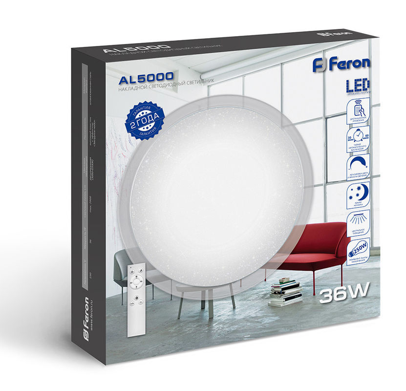

# feron-led-advanced-control

Advanced control system for Feron luminaires (and others), built on the basis of [Maxic's](http://www.maxictech.com/en/)  Chinese LED controllers.
***

***
## Project goals
* save the ability to control the standard IR remote control
* add some extra commands for using in smarthome via demodulated [NEC IR protocol](https://www.sbprojects.net/knowledge/ir/nec.php)
* properly maintain power failure
* expand gamma range
* more precise in animation

***

## Hardware

The luminaire contains 2 channels of LEDs with different glow temperatures, which are controlled by dimming power LED controllers. Thus, providing the ability to mix two channels with different power. In this case, it is not allowed to exceed the total power of the channels above the nominal value. Otherwise, overheating and failure of the lamp will occur. Keep this in mind if you make a change to the firmware.

2 types of LED controllers are currently tested and supported:

* [Maxic MT7860 (recommended)](http://www.maxictech.com/Content/2018/10-09/1707139255.html)
Used in my [Feron AL5000 36W](https://shop.feron.ru/catalog/nakladnye_svetodiodnye_svetilniki/svetodiodnyy_upravlyaemyy_svetilnik_nakladnoy_feron_al5000_tarelka_36w_3000k_6500k_belyy_s_kantom/). Controlled by 8-bit PWM signal. I use ATtiny13A, very small SOP-8 MCU with 1KB of Flash, running @600KHz.
* [Maxic MT7817BD (older)](http://www.chimicron.com/datasheet/maxic/MT7817BD.pdf)
Used in my [Feron AL5302 60W](https://shop.feron.ru/catalog/nakladnye_svetodiodnye_svetilniki/svetodiodnyy_upravlyaemyy_svetilnik_nakladnoy_feron_al5302_tarelka_60w_3000k_6500k_belyy/). Controlled by analog signal (PWM is highly unstable). I use ATtiny2313A with 2KB of Flash, running @500KHz.

Sample PCBs in project folders (format SprintLayout 6.0).

***

## Software

Project written on pure [AVR assembly language](http://ww1.microchip.com/downloads/en/devicedoc/atmel-0856-avr-instruction-set-manual.pdf)  in official [Atmel Studio 7.0](https://www.microchip.com/mplab/avr-support/atmel-studio-7).

***

### License
Software is licensed under [GPL v3](https://www.gnu.org/licenses/gpl-3.0.en.html).
